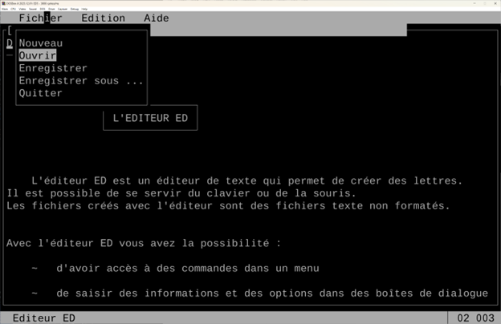
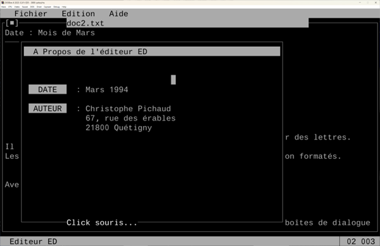

**💾 EDITED: A 1994 MS-DOS Text Editor (Turbo-C Project)**

Author: Christophe Pichaud

Date: March 1994

Technology: C Language, Turbo-C Compiler, MS-DOS

**👨‍💻 Educational Value: The Case for Mastering Fundamentals**

This project, developed in 1994 using C on the MS-DOS platform, serves
as a powerful teaching tool for a core principle of software
development: **Mastery of system internals is the foundation for
creating high-quality, efficient software.**

In the modern era of high-level frameworks and vast abstractions, the
underlying \"big stuff\"---system programming, raw memory management,
and hardware interaction---can be easily overlooked. This code is a time
capsule demonstrating that true application development requires time
invested in mastering every component, from the CPU to the screen
buffer.

Overview:

**What this project teaches modern developers:**

1.  **System Programming:** Writing directly to memory and handling
    interrupts (INT 33h) forces a deep understanding of how a computer
    works.

2.  **Performance Optimization:** Bypassing operating system layers to
    achieve speed (e.g., direct video memory access).

3.  **Architectural Separation:** The successful division of
    responsibilities between a low-level utility library (UTIL.H) and
    the high-level application logic (ED5.C).

4.  **UI/UX Engineering:** Building a robust, interactive user
    experience (TUI) from nothing but character cells and logic.

**🛠️ Technical Deep Dive: The Codebase**

The editor is cleanly split into two modules, demonstrating excellent
**modular design** principles for a 1994 project.

**1. UTIL.H: The Low-Level System and UI Library**

This file contains the core functions for **system programming** and
**Text-based User Interface (TUI) rendering**. It is a hand-coded
abstraction layer for the MS-DOS environment.

**Direct Memory Access (The \"Graphics Card Driver\")**

The most critical part of UTIL.H is its approach to screen drawing:

- **Video Memory Address:** The constant \#define MODE 0xb800 explicitly
  targets the **CGA/EGA/VGA text mode video memory segment**.

- **High-Speed Screen Writing:** The function AffCar calculates the
  exact address in video memory for a character and its attribute using
  the MK_FP macro and a char far \*ptr. This technique bypasses slow
  BIOS calls to achieve maximum speed for screen redraws:

C

// Direct write to video memory for fast screen updates

char far \*ptr=MK_FP(MODE,80\*2\*(y-1)+(x-1)\*2);

\*ptr = car; // Character byte

\*(ptr+1) = attribut; // Attribute byte (color)

- **Color/Attributes:** The code defines standard DOS color attributes
  like NORMAL 7 (White on Black) and INVERSE 112 (Black on White) for
  highlighting menu items.

**Mouse and Input Handling (Interrupt-Driven I/O)**

Mouse interaction is handled by directly interfacing with the MS-DOS
mouse driver via **Software Interrupt 33h**.

- **Initialization:** MountMouse calls int86(0x33, \...) with
  \$AX=0x0000\$ to check for and activate the mouse driver.

- **Status Reading:** Functions like LeftMouseButton and XMouse/YMouse
  use \$AX=0x0003\$ to read position and button states.

- **Pixel-to-Character Mapping:** The code correctly converts raw mouse
  pixel coordinates into the text-mode character grid using bit-shifting
  (division by 8):

C

// Converting raw pixel X coordinate (in CX) to character column

x=registre.x.cx;

x=x\>\>3; // Equivalent to x / 8

- **TUI Primitives:** UTIL.H contains functions like cadre_s (single
  frame) and cadre_d (double frame) which use the extended **ASCII/ANSI
  box-drawing characters** (Ú, Ä, É, Í, etc.) to build the
  pseudo-graphical windows and menus.

**2. ED5.C: The Application and UI Logic**

This file implements the full logic of the editor, including file I/O,
text buffer management, and the user-facing event loop.

**High-Level Text Buffer Management**

The editor uses a fixed-size, 2D array (static char
buffer\[MaxY+50\]\[80\]) to store the entire document in memory.

- **Max Buffer Size:** MaxY 200 lines is defined, demonstrating a
  consideration for memory allocation and the maximum document size the
  editor can handle.

- **Scrolling Logic:** Functions like BufferToEcran and YEcran manage
  the viewport, calculating which line of the large buffer array should
  be displayed on which of the 21 text lines available in the editing
  area (MinY 3 to 23). This is the core of the editor\'s scrolling
  mechanism.

**Complex Editing Features**

The code implements surprisingly advanced text manipulation for a TUI
editor:

- **Insert Mode:** The insert flag is handled meticulously in the main
  loop and within line-editing functions. In insert mode, inserting a
  character or pressing RETURN causes an explicit, manual shifting of
  all characters or lines in the memory buffer.

- **Geometric Drawing:** Functions like CadreSimple, LigneHSimple, and
  LigneVDouble allow the user to draw character-based shapes on the fly
  using the mouse to define coordinates, then call EcranToBuffer to save
  the drawn content back into the main text buffer.

**The Central Event Loop**

The main function continuously checks for user input (kbhit) and mouse
clicks, then dispatches the action. This **message-driven architecture**
is the predecessor to modern GUI event systems.

- **Menu Navigation:** Mouse clicks or ALT key combinations (e.g., ALT_F
  for Fichier menu) seamlessly jump to dedicated menu handler routines
  (menu1, menu2, menu3), showcasing clean control flow for the
  interface.

- **Dialogs:** The use of requester_s and gettext/puttext to manage
  dialog boxes (like \"Enregistrer sous\...\" or \"Quitter\")
  demonstrates careful **state management**, where the background screen
  content is preserved and restored after the user interacts with the
  foreground pop-up.

**📅 Project Details and Historical Context**

- **Project Name:** L\'éditeur ED (The ED Editor)

- **Interface Type:** Text-based User Interface (TUI)

- **Language & Compiler:** C, compiled with Turbo-C (likely the Turbo
  C++ 3.0 or 4.0 DOS versions in use in 1994).

- **Operating System Target:** MS-DOS.

This project sits at the cusp of the shift from DOS to Windows,
showcasing a highly optimized, fully featured alternative to purely
command-line editors of the time. The level of detail required for a
project of this nature is immense, validating the teaching principle
that **true understanding comes from building things from the ground up,
one low-level piece at a time.**
